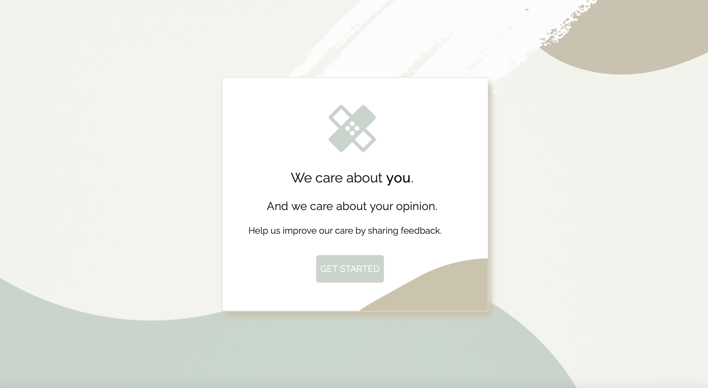

# Tendo Toy

[](https://opensource.org/licenses/MIT)

## Table of Contents

- [Description](#description)
- [User Story](#user-story)
- [Preview of Tendo Toy](#preview-of-tendo-toy)
- [Links](#links)
- [Built Using](#built-using)
- [Usage](#usage)
- [License](#license)
- [Questions](#questions)

## Description

Tendo Toy is a toy program that collects patient feedback after an appointment. The program is a full-stack application built using Node, React, Express, and MongoDB. The Material UI CSS framework was used heavily to implement a simple and customizable application. The application also utilizes Redux for state management.

A script was provided with the type of questions that the patient was to be asked and the expected behavior of the user in using the application. Sample data was also provided in JSON format with the patient, doctor, and appointment details, which were loaded and rendered to be utilized in the given script.

## User Story

```
AS A user
I WANT TO answer questions about my experience as a patient
SO THAT I can provide feedback to better improve services.
```

## Preview of Tendo Toy



## Links

- [Deployed Application](https://tendo-toy.herokuapp.com)

- [Github Repository](https://github.com/rh9891/TendoToy)

## Built Using

Listed below are the frameworks, libraries, and guides that made building this application possible:

- [Express](https://expressjs.com/)
- [Material UI](https://mui.com/)
- [MongoDB](https://www.mongodb.com/what-is-mongodb)
- [Node](https://nodejs.org/en/about/)
- [React](https://reactjs.org/docs/getting-started.html)

## Usage

The application can be initiated by inputting `npm run dev` into the command line interface and running the application on `localhost: 3000`.

## License

The MIT License (MIT)

Copyright (c) 2021 Romie Hecdivert

Permission is hereby granted, free of charge, to any person obtaining a copy of this software and associated documentation files (the "Software"), to deal in the Software without restriction, including without limitation the rights to use, copy, modify, merge, publish, distribute, sublicense, and/or sell copies of the Software, and to permit persons to whom the Software is furnished to do so, subject to the following conditions:

The above copyright notice and this permission notice shall be included in all copies or substantial portions of the Software.

THE SOFTWARE IS PROVIDED "AS IS", WITHOUT WARRANTY OF ANY KIND, EXPRESS OR IMPLIED, INCLUDING BUT NOT LIMITED TO THE WARRANTIES OF MERCHANTABILITY, FITNESS FOR A PARTICULAR PURPOSE AND NONINFRINGEMENT. IN NO EVENT SHALL THE AUTHORS OR COPYRIGHT HOLDERS BE LIABLE FOR ANY CLAIM, DAMAGES OR OTHER LIABILITY, WHETHER IN AN ACTION OF CONTRACT, TORT OR OTHERWISE, ARISING FROM, OUT OF OR IN CONNECTION WITH THE SOFTWARE OR THE USE OR OTHER DEALINGS IN THE SOFTWARE.

## Questions

If you have any questions, comments, or issues regarding this application, please do not hesitate to contact me via [Github](https://github.com/rh9891).
